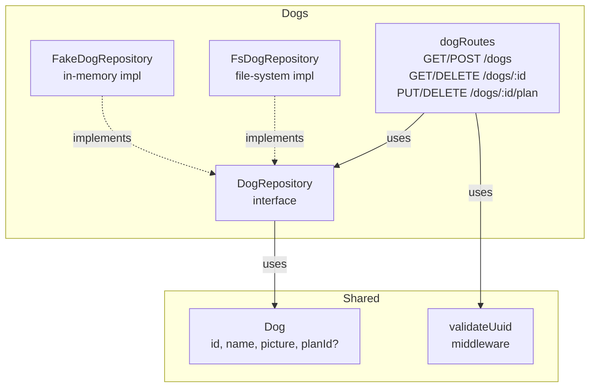
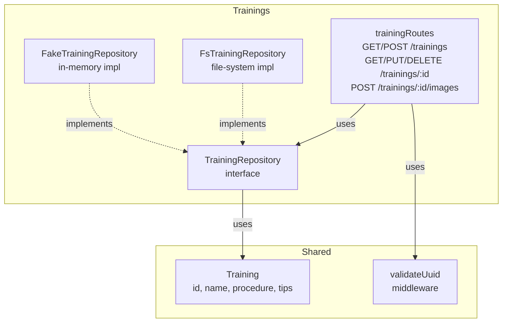
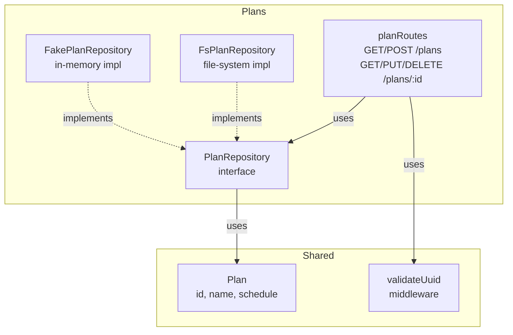
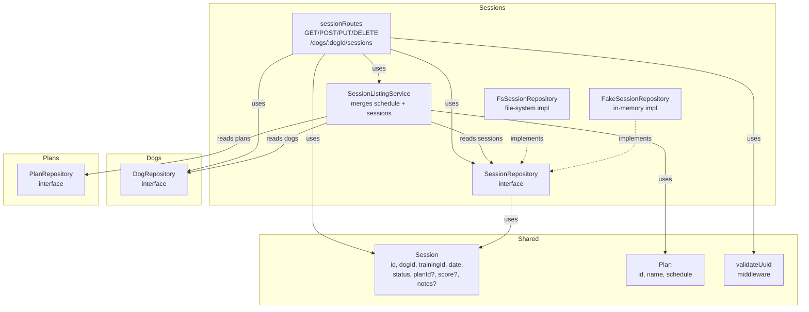

# Backend Architecture - Component Diagrams

## Component diagram

### Dogs

```mermaid
flowchart TD
    subgraph Dogs
        dogRoutes["dogRoutes<br/>GET/POST /dogs<br/>GET/DELETE /dogs/:id<br/>PUT/DELETE /dogs/:id/plan"]
        DogRepository["DogRepository<br/>interface"]
        FsDogRepository["FsDogRepository<br/>file-system impl"]
        FakeDogRepository["FakeDogRepository<br/>in-memory impl"]
    end

    subgraph Shared
        Dog["Dog<br/>id, name, picture, planId?"]
        validateUuid["validateUuid<br/>middleware"]
    end

    dogRoutes -->|uses| DogRepository
    dogRoutes -->|uses| validateUuid
    DogRepository -->|uses| Dog
    FsDogRepository -.->|implements| DogRepository
    FakeDogRepository -.->|implements| DogRepository
```

### Trainings

```mermaid
flowchart TD
    subgraph Trainings
        trainingRoutes["trainingRoutes<br/>GET/POST /trainings<br/>GET/PUT/DELETE /trainings/:id<br/>POST /trainings/:id/images"]
        TrainingRepository["TrainingRepository<br/>interface"]
        FsTrainingRepository["FsTrainingRepository<br/>file-system impl"]
        FakeTrainingRepository["FakeTrainingRepository<br/>in-memory impl"]
    end

    subgraph Shared
        Training["Training<br/>id, name, procedure, tips"]
        validateUuid["validateUuid<br/>middleware"]
    end

    trainingRoutes -->|uses| TrainingRepository
    trainingRoutes -->|uses| validateUuid
    TrainingRepository -->|uses| Training
    FsTrainingRepository -.->|implements| TrainingRepository
    FakeTrainingRepository -.->|implements| TrainingRepository
```

### Plans

```mermaid
flowchart TD
    subgraph Plans
        planRoutes["planRoutes<br/>GET/POST /plans<br/>GET/PUT/DELETE /plans/:id"]
        PlanRepository["PlanRepository<br/>interface"]
        FsPlanRepository["FsPlanRepository<br/>file-system impl"]
        FakePlanRepository["FakePlanRepository<br/>in-memory impl"]
    end

    subgraph Shared
        Plan["Plan<br/>id, name, schedule"]
        validateUuid["validateUuid<br/>middleware"]
    end

    planRoutes -->|uses| PlanRepository
    planRoutes -->|uses| validateUuid
    PlanRepository -->|uses| Plan
    FsPlanRepository -.->|implements| PlanRepository
    FakePlanRepository -.->|implements| PlanRepository
```

### Sessions

```mermaid
flowchart TD
    subgraph Sessions
        sessionRoutes["sessionRoutes<br/>GET/POST/PUT/DELETE<br/>/dogs/:dogId/sessions"]
        SessionListingService["SessionListingService<br/>merges schedule + sessions"]
        SessionRepository["SessionRepository<br/>interface"]
        FsSessionRepository["FsSessionRepository<br/>file-system impl"]
        FakeSessionRepository["FakeSessionRepository<br/>in-memory impl"]
    end

    subgraph Shared
        Session["Session<br/>id, dogId, trainingId, date,<br/>status, planId?, score?, notes?"]
        Plan["Plan<br/>id, name, schedule"]
        validateUuid["validateUuid<br/>middleware"]
    end

    subgraph Dogs
        DogRepository["DogRepository<br/>interface"]
    end

    subgraph Plans
        PlanRepository["PlanRepository<br/>interface"]
    end

    sessionRoutes -->|uses| DogRepository
    sessionRoutes -->|uses| SessionRepository
    sessionRoutes -->|uses| SessionListingService
    sessionRoutes -->|uses| validateUuid
    sessionRoutes -->|uses| Session
    SessionListingService -->|reads dogs| DogRepository
    SessionListingService -->|reads plans| PlanRepository
    SessionListingService -->|reads sessions| SessionRepository
    SessionListingService -->|uses| Plan
    SessionRepository -->|uses| Session
    FsSessionRepository -.->|implements| SessionRepository
    FakeSessionRepository -.->|implements| SessionRepository
```
