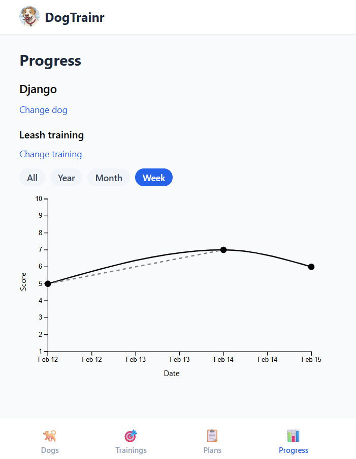

So first off in the progress report the dog selection tiles look nothing like the dog selection tiles elsewhere. Take a look at the dog list screen. That's the exact button I want. Make a reusable style out of it.

Well if the backend is down and the front end is running, I see like no dogs registered yet, which smells like a 404 response, but if there's no backend, you should be getting a 500. So I want to see that something is wrong in the front end uh instead of a there is no dog uh registered yet, because that is not the actual problem. So do proper response code uh handling in the frontend. If it's a 404, that's a not found, but if it's anything else, uh we should not be seeing uh 404. Uh maybe do like a toast or just render some text saying that uh there's a problem uh with the app.

The progress report looks good, but there's a problem with the completed versus the skip, how they get rendered. Right now, if there is a skiped session in between two completed sessions, there is a dotted line connecting the two completed sessions, but there's also a solid black line between those two. That's not what I want. I want one line, and it is either solid if it's two consecutive completed sessions without a skip one in between, or uh if there's a skip one in between, I want it to be part of the same curved line, but dotted, and not two lines in parallel as it is right now. I will provide a screenshot for reference. 

The back button on my browser is not working as expected, so please implement proper uh back behavior uh for a browser single page app.